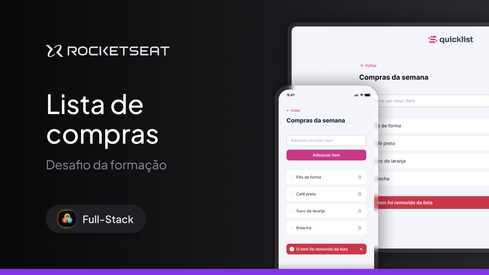

# [Challenge] Quicklist



Quicklist é um site responsivo de lista de compras onde os usuários podem gerenciar itens de suas listas, adicionando novos itens, marcando-os como concluídos e removendo-os. O projeto foi desenvolvido com HTML, CSS e JavaScript, e utiliza o armazenamento local para salvar a lista de compras.

## Funcionalidades

- **Adicionar itens**: Os usuários podem adicionar novos itens à lista.
- **Remover itens**: Itens podem ser removidos da lista ao serem marcados como concluídos.
- **Notificações**: Notificações são exibidas quando um item é removido ou quando um item não é selecionado para exclusão.
- **Armazenamento Local**: A lista de compras é salva localmente no navegador e permanece disponível mesmo após o fechamento e reabertura do navegador.

## Estrutura do Projeto

O projeto é composto pelos seguintes arquivos e pastas:

## 📂 Estrutura do Projeto

```plaintext
📂 convert
 ├── 📁 img           # Imagens do projeto
 ├── 📄 index.html    # Estrutura da página
 ├── 📄 styles.css    # Estilização do projeto
 ├── 📄 scripts.js    # Lógica da lista
 ├── 📄 README.md     # Documentação do projeto
```

 ## 🔧 Como executar o projeto

1. Clone este repositório
   ```sh
   git clone https://github.com/Caiobalduino/-challenge-quicklist.git
   ```
2. Acesse a pasta do projeto
   ```sh
   cd -challenge-quicklist
   ```
3. Abra o arquivo `index.html` no navegador
